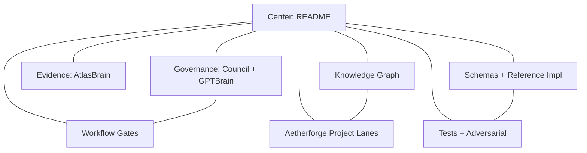

# Manus Artifacts

This repository contains research, health data, and system artifacts generated and managed by Manus.

## Metatron topology (candidate map)

## Table of Contents

### Core Systems
- **[Aluminum OS](./aluminum-os/)** — Constitutional substrate for regenerative computing.
  - [v4.0 Unified Field](./aluminum-os/v4.0-unified-field.md) (Canonical)
  - [v4.0 Socratic OS Integration](./aluminum-os/v4.0-socratic-os-integration-report.md)
  - [v3.0 Unified Field](./aluminum-os/v3.0-unified-field.md)
  - [v2.0 Constitutional Substrate](./aluminum-os/v2.0-integrated-constitutional-substrate.md)
- **[SheldonBrain](./sheldonbrain/)** — System architecture and knowledge substrate.
  - [System Architecture](./sheldonbrain/system-architecture.md)
- **[BAZINGA](./bazinga/)** — Constitutional middleware and launch protocols.
  - [v0.1 Launch Decree](./bazinga/v0.1-launch-decree.md)

### Projects
- **[Free Bank](./projects/free-bank/)** — Banking revolution and financial sovereignty.
- **[Chinook Guardian](./projects/chinook-guardian/)** — Aerospace and defense protocols.
- **[Three-Tier Autonomy](./projects/three-tier-autonomy/)** — Policy framework for agentic autonomy.
- **[Aetherforge Top-10 Taskboard (2026-05-26)](./projects/aetherforge-top10-taskboard-2026-05-26.md)** — Historical valuation board (archived snapshot).
- **[Aetherforge Game World (Module 8)](./projects/aetherforge-game-world/README.md)** — Quest taxonomy, Archive Bowl index, Omnispec candidate framing, and onboarding template.
- **[Aetherforge Top-100 Quest Ledger](./projects/aetherforge-game-world/AETHERFORGE_TOP100_QUEST_LEDGER_v0.1.md)** — Optimal next-100 tasks across all repo components in Metatron's Cube ring topology.
- **[Aetherforge 144-Task Campaign (2026-05-28)](./projects/aetherforge-144-task-campaign-2026-05-28.md)** — 12 waves of 12 tasks sequenced for world-class execution.
- **[Aetherforge Top-10 Sprint Board (2026-05-28)](./projects/aetherforge-top10-taskboard-2026-05-28.md)** — Current top-10 unblocked sprint execution list.
- **[Projects Board Hierarchy](./projects/README.md)** — Routing map linking 144→100→50→10 boards and project lanes.

### Governance & Council
- **[Council](./council/)** — Trinity and Pantheon Council session archives.
- **[Council Reviews](./council-reviews/)** — External reviews and validation.
- **[Boot / Council Brain Index](./archive/boot/COUNCIL_BRAIN_INDEX.md)** — Canonical substrate doctrine and seat registry.
- **[Krakoa Canon Truth Spine](./archive/boot/gptbrain/KRAKOA_CANON_TRUTH_SPINE_2026-05-26.md)** — Mandatory authority read order for governance decisions.
- **[GPTBrain Index of Indexes](./archive/boot/gptbrain/GPTBRAIN_INDEX_OF_INDEXES_2026-05-26.md)** — Fast navigation for Krakoa habitat docs.
- **[AtlasBrain Index](./archive/boot/atlasbrain/ATLASBRAIN_INDEX_2026-05-26.md)** — Evidence-lane routing and gate map.
- **[Krakoa Top 50 Execution Ledger](./archive/boot/gptbrain/KRAKOA_TOP_50_EXECUTION_LEDGER_2026-05-26.md)** — Active execution backlog and completion status.

### Archives & Research
- **[Janus Checkpoints](./archives/janus-checkpoints/)** — Session state and resurrection logs.
- **[Research](./research/)** — Intelligence sweeps and convergence reports.
- **[Health](./health/)** — Patient rights and wellness facility research.
- **[Manus Vault](./manus-vault/)** — Internal session summaries and Noah's Ark protocols.
- **[Knowledge Graph](./archive/knowledge_graph/GRAPH_INDEX.md)** — Repo-wide graph index, topology map, and seed ledgers.

### Docs & onboarding
- **[Start Here](./docs/START_HERE.md)** — First-stop orientation for contributors and public readers.
- **[Archive Index](./docs/ARCHIVE_INDEX.md)** — Directory routing map across archive and adjacent lanes.
- **[Glossary](./docs/GLOSSARY.md)** — Shared vocabulary for governance, Aetherforge, and GPTDream++ protocols.
- **[Lattice Hypercube 12×12×12](./docs/LATTICE_HYPERCUBE_12x12x12.md)** — Public-safe candidate explainer for the Atlas Lattice / Rainbow Yin Yang Lattice.

### About
- **[David Sheldon](./about/david-sheldon.md)** — Visionary and system architect.

---
*Generated by Manus Agent*
