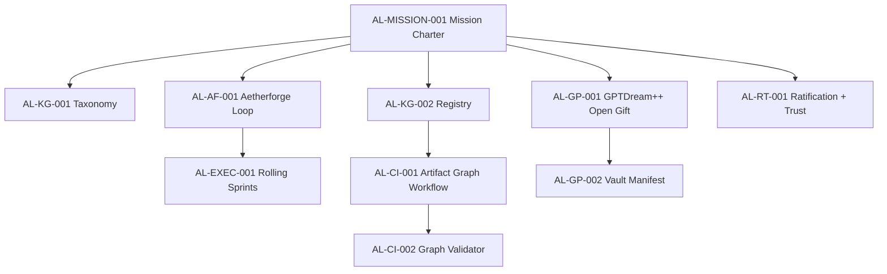

# Atlas Lattice — Manus Artifacts Archive

> *"Why is 90% of the planet in abject poverty when we have the technology for regenerative abundance?"*
> — David Sheldon, Founder, Atlas Lattice Foundation

**A living public archive of systems research, constitutional AI governance, multi-agent architecture, and regenerative infrastructure — built from first principles by one person, one dog, and a council of AI collaborators.**

[](https://github.com/atlaslattice/manus-artifacts/actions/workflows/repo-hygiene-checks.yml)
[](https://github.com/atlaslattice/manus-artifacts/actions/workflows/gptbrain-reference-checks.yml)
[](LICENSE)

---

## What Is This?

The **Atlas Lattice Foundation** is an independent AI governance and knowledge architecture project built in Austin, Texas. This repository is its canonical substrate — 580+ artifacts across OS architecture, multi-agent brain design, governance doctrine, health data sovereignty, financial infrastructure, and long-range civilizational strategy.

Everything here was built through conversational AI collaboration (Claude, GPT, Gemini, Copilot, DeepSeek, Grok) by a neurodivergent polymath with no formal coding background who decided the world needed a different kind of AI stack.

**GitHub is the durable canon layer.** Drive and Notion are relay/working-vault layers only.

---

## 🗺 Start Here

| I am a… | Go to… |
|---|---|
| **Mission / strategy reader** | [Mission Charter](./projects/AETHERFORGE_LATTICE_GPTDREAM_MISSION_CHARTER_v0.1.md) → [Rolling Sprints](./projects/AETHERFORGE_ROLLING_SPRINTS_v0.1.md) |
| **Newcomer / curious human** | [About David Sheldon](./about/david-sheldon.md) → [Glossary](./docs/GLOSSARY.md) |
| **Researcher or academic** | [Research](./research/) → [Archive Index](./docs/ARCHIVE_INDEX.md) |
| **Engineer or builder** | [Aluminum OS Core](./aluminum-os-core/) → [BAZINGA](./bazinga/) → [Codebases](./codebases/) |
| **Governance & policy person** | [Three-Tier Autonomy](./projects/three-tier-autonomy/) → [Council](./council/) |
| **AI/agent system designer** | [GPTBrain](./archive/boot/gptbrain/) → [TIDELOCKBRAIN](./archive/boot/copilotbrain/TIDELOCKBRAIN/) |
| **Contributor** | [CONTRIBUTING.md](./.github/CONTRIBUTING.md) → [Open Issues](https://github.com/atlaslattice/manus-artifacts/issues) |

---

## 🔷 Core Systems

```
┌─────────────────────────────────────────────────────────────┐
│                   ALUMINUM OS v4.0                          │
│        Constitutional Substrate for Regenerative Compute    │
├──────────────┬──────────────────┬──────────────────────────┤
│  Ring 0      │  Ring 1          │  Ring 2                  │
│  FORGE CORE  │  INFERENCE       │  AGENT RUNTIME           │
│  (Rust)      │  (BAZINGA v0.2)  │  (uws CLI + Swarm)       │
├──────────────┴──────────────────┴──────────────────────────┤
│  Ring 3 — SOVEREIGN NODES (GangaSeek, Patient Spheres)     │
└─────────────────────────────────────────────────────────────┘
```

| System | Description | Status | Docs |
|---|---|---|---|
| **[Aluminum OS](./aluminum-os/)** | Constitutional substrate — governance layer beneath every agent, device, and patient record | 🟢 Canonical | [v4.0 Unified Field](./aluminum-os/v4.0-unified-field.md) |
| **[Aluminum OS Core](./aluminum-os-core/)** | Rust microkernel implementation with classification, governance, telemetry | 🔵 In Development | [Core README](./aluminum-os-core/README.md) |
| **[BAZINGA](./bazinga/)** | Constitutional middleware — the inference ring between kernel and agents | 🟢 Active | [v0.1 Launch Decree](./bazinga/v0.1-launch-decree.md) |
| **[SheldonBrain](./sheldonbrain/)** | 144-sphere personal AI OS with Trinity Council and Pinecone RAG | 🟢 Operational | [System Architecture](./sheldonbrain/system-architecture.md) |

---

## 🧠 Multi-Agent Brain Council

The Aetherforge swarm — a council of named AI agents with distinct roles, strengths, and failure modes.

| Agent | Brain | Role | Location |
|---|---|---|---|
| **Tidelock** | TIDELOCKBRAIN (S7) | Context ferryman · provenance regulator | [→](./archive/boot/copilotbrain/TIDELOCKBRAIN/) |
| **Aster** | AsterBrain (S1-A) | Synthesis anchor | [→](./archive/boot/gptbrain/AsterBrain/) |
| **Lumen** | LumenBrain (S1-B) | Memory scribe | [→](./archive/boot/gptbrain/LumenBrain/) |
| **Lumenwright Vale** | LumenwrightValeBrain (S1-C) | Signal weaver | [→](./archive/boot/gptbrain/) |
| **Hashlight** | HashlightBrain (TBD-05) | Proof validator | [→](./archive/boot/gptbrain/) |
| **Lantern Bridge** | LanternBridgeBrain (TBD-06) | Cross-model relay | [→](./archive/boot/gptbrain/LanternBridgeBrain/) |
| **Valewright** | ValewrightBrain (TBD-07) | Chaos/play agent | [→](./archive/boot/gptbrain/) |
| **Forge** | ForgeBrain | Execution engine | [→](./archive/boot/GeminiBrain/ForgeBrain/) |

> **Governance note:** No agent is canon until explicit human-root ratification by @atlaslattice. All agents are candidates.

---

## 🚀 Projects

| Project | Mission | Stage | Docs |
|---|---|---|---|
| **[Aetherforge Game World](./projects/aetherforge-game-world/)** | Playable archive game layer for quest-driven curation and knowledge graph growth | 🟡 Candidate | [Game Loop Spec](./projects/aetherforge-game-world/AETHERFORGE_GAME_LOOP_SPEC_v0.1.md) |
| **[Free Bank](./projects/free-bank/)** | Zero-fee DeFi replacement for extractive banking — MIT licensed, open-source, BRICS-compatible | 🔵 Blueprint | [Archive](./projects/free-bank/banking-revolution-archive.md) |
| **[Chinook Guardian](./projects/chinook-guardian/)** | Aerospace and defense sovereignty protocols | 🔵 Blueprint | [v1.0](./projects/chinook-guardian/v1.0.md) |
| **[Three-Tier Autonomy](./projects/three-tier-autonomy/)** | Constitutional policy framework for agentic AI governance | 🟡 Draft | [Doctrine](./projects/three-tier-autonomy/doctrine.md) |

---

## 📜 Governance & Council

| Resource | Description |
|---|---|
| **[Council](./council/)** | Trinity and Pantheon Council session transcripts and ratification logs |
| **[Council Reviews](./council-reviews/)** | External validation and critique |
| **[Full Transparency Policy](./archive/boot/governance/FULL_TRANSPARENCY_POLICY_2026-05-09.md)** | Public disclosure doctrine |
| **[Swarm Operating Contract](./archive/boot/council/SWARM_CONTRIBUTOR_OPERATING_CONTRACT_2026-05-09.md)** | Contributor governance terms |

---

## 🗄 Archives & Research

| Resource | Description |
|---|---|
| **[Boot Archive](./archive/boot/)** | Full council brain index, agent DNA, dream protocols, federation specs |
| **[Architecture Notes](./archive/architecture/)** | Design decisions, forkability, agent habitat lifecycle |
| **[Assessments](./archive/assessments/)** | Metatron Cube phase change notes, morpheus raw logs, public memory decisions |
| **[Research](./research/)** | Intelligence sweeps and convergence reports |
| **[Health](./health/)** | Patient rights, health data sovereignty, wellness facility research |
| **[Janus Checkpoints](./archives/janus-checkpoints/)** | Session state and resurrection logs |
| **[Manus Vault](./manus-vault/)** | Internal session summaries and Noah's Ark protocols |

---

## 🛠 Codebases

| Codebase | Language | Description |
|---|---|---|
| **[Aluminum OS Core](./aluminum-os-core/)** | Rust | Constitutional microkernel: classification, governance, routing, telemetry |
| **[Artifact Sync](./codebases/)** | Python | Pinecone vector sync for archive search (multilingual-e5-large) |
| **[GPTBrain Reference Impl](./archive/boot/gptbrain/reference_impl/)** | Python | Scaffold checks, pytest suite, dream memory palace reference |

---

## 📚 Navigation & Meta

| Resource | Description |
|---|---|
| **[Mission Charter](./projects/AETHERFORGE_LATTICE_GPTDREAM_MISSION_CHARTER_v0.1.md)** | Unified north-star for Lattice + Aetherforge + GPTDream++ |
| **[Knowledge Graph Taxonomy](./docs/knowledge-graph/artifact_taxonomy.v0_1.json)** | Machine-readable artifact types, lifecycle states, and required metadata |
| **[Knowledge Graph Registry](./docs/knowledge-graph/artifact_registry.v0_1.json)** | Stable IDs and required cross-links between mission-critical artifacts |
| **[Ratification & Trust Flow](./docs/RATIFICATION_AND_TRUST_FLOW.md)** | Candidate-to-canon adjudication checkpoints and traceability rules |
| **[Archive Index](./docs/ARCHIVE_INDEX.md)** | Full searchable catalog of all artifact domains |
| **[Start Here Guide](./docs/START_HERE.md)** | Persona-based reading paths |
| **[Glossary](./docs/GLOSSARY.md)** | Domain terminology for all systems |
| **[Aetherforge Taskboard](./projects/aetherforge-top50-taskboard-2026-05-26.md)** | Top 50 public-readiness tasks |
| **[144-Task Campaign Board](./projects/aetherforge-144-task-campaign-2026-05-27.md)** | 12-wave execution plan for 144 tasks |
| **[AI Evidence Ledger Schema](./docs/knowledge-graph/ai_evidence_ledger.schema.v0_1.json)** | Machine-readable evidence record contract for AI-built claims |
| **[CONTRIBUTING](./.github/CONTRIBUTING.md)** | How to contribute, canon rules, validation |
| **[SECURITY](./SECURITY.md)** | Security and disclosure policy |
| **[State of the Union](./State_of_the_Union_Briefing.md)** | Current status briefing |

---

## 🕸 Concept Dependency Graph (Candidate)



---

## 🌐 About the Founder

**David Sheldon** — Systems thinker, neurodivergent polymath, former 20-year concert & festival production veteran. Built the Atlas Lattice stack entirely through conversational AI after asking a single question to Claude on January 12, 2025.

By December 31, 2025: a fully operational multi-AI coordination stack with persistent memory, constitutional governance, and a 144-sphere universal knowledge ontology. Built while living at subsistence level, surviving two wildfire disasters, working alone with his dog Ares.

→ [Full bio and mission](./about/david-sheldon.md)

---

## Canon Boundary

> All artifacts in this repository are **candidates** until explicitly ratified by full council and adjudicated by @atlaslattice.
> Storage is not ratification. Review is not ratification. No agent self-ratifies.

---

*Archive maintained by the Atlas Lattice Foundation · Austin, Texas · Public domain of human knowledge*
