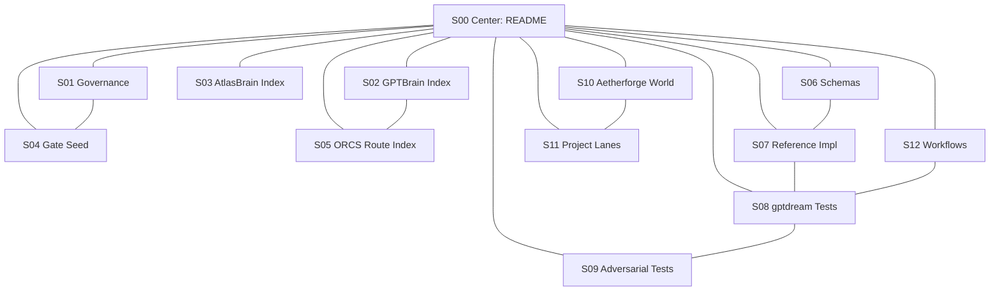

# Metatron Cube Topology Map

```text
STATUS: TOPOLOGY MAP — NOT CANON
DATE: 2026-05-28
CANON STATUS: candidate
AUTHORITY: architectural routing map only
PURPOSE: map center + 12 spheres to concrete repository components
```

## 13-sphere routing map

| Sphere | Ring | Theme | Primary repository surface |
|---|---|---|---|
| S00 | Center | Repo command nexus | `README.md` |
| S01 | Ring 1 | Governance and canon | `archive/boot/COUNCIL_BRAIN_INDEX.md` |
| S02 | Ring 1 | GPTBrain routing | `archive/boot/gptbrain/GPTBRAIN_INDEX_OF_INDEXES_2026-05-26.md` |
| S03 | Ring 1 | AtlasBrain evidence | `archive/boot/atlasbrain/ATLASBRAIN_INDEX_2026-05-26.md` |
| S04 | Ring 1 | Gate control | `archive/boot/gptbrain/KRAKOA_GATE_INDEX.seed.jsonl` |
| S05 | Ring 1 | ORCS route substrate | `archive/knowledge_graph/ORCS_ROUTE_INDEX.seed.jsonl` |
| S06 | Ring 2 | Schema contracts | `schemas/atlas_orcs/v0_1/` |
| S07 | Ring 2 | Reference implementation | `reference_impl/` |
| S08 | Ring 2 | Trial arena | `tests/gptdream/` |
| S09 | Ring 2 | Adversarial arena | `tests/adversarial/` |
| S10 | Ring 2 | Aetherforge world | `projects/aetherforge-game-world/` |
| S11 | Ring 2 | Cross-project deployment lanes | `projects/free-bank/`, `projects/chinook-guardian/`, `projects/three-tier-autonomy/` |
| S12 | Ring 2 | Workflow execution | `.github/workflows/` |

## Mermaid topology


