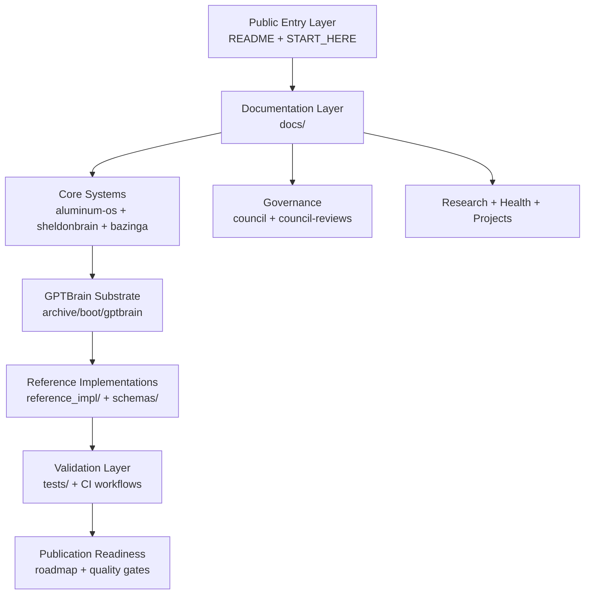

# Architecture Map — Atlas Lattice

## Layered System Map

## Domain Boundaries

- **Canonical substrate:** GitHub repository content.
- **Artifact lifecycle:** DRAFT → CANDIDATE → CANONICAL (or ARCHIVED).
- **Quality interface:** workflows and test suites enforce baseline integrity.
- **Gameplay framing:** Aetherforge task waves map work into progressive rings.
