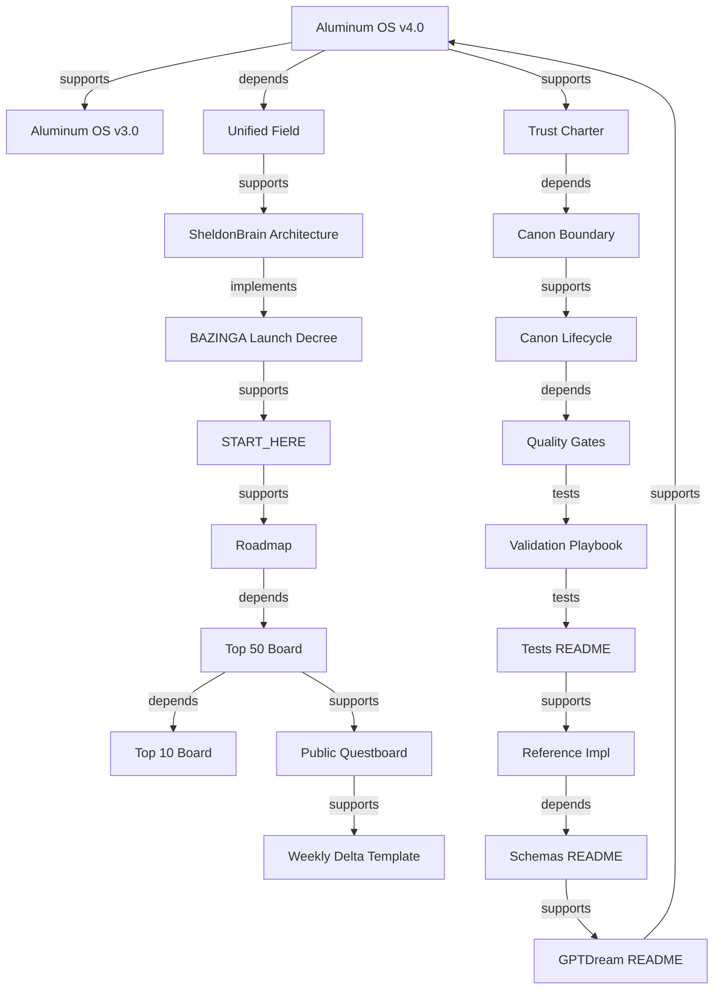
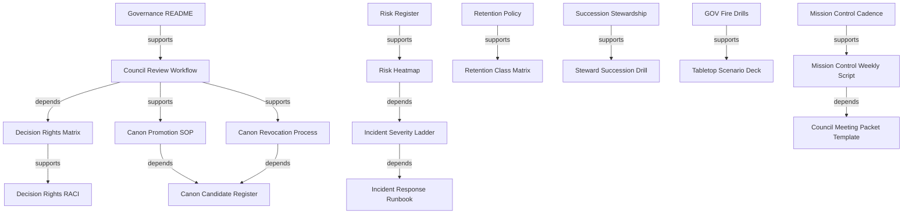
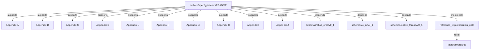
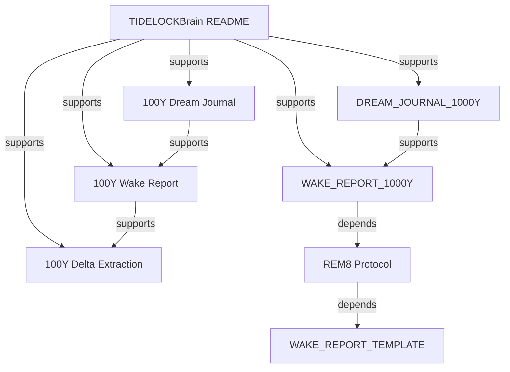

# KG Domain Subgraphs
Status: Candidate
Date: 2026-05-28

Domain-level subgraphs for Wave 3 topology expansion with typed edges.

## Systems subgraph (20 nodes)

Nodes: 20

## Governance subgraph (15 nodes)

Nodes: 15

## GPTDream++ / Spec subgraph (15 nodes)

Nodes: 15

## TIDELOCKBrain subgraph (10 nodes)

Nodes: 10

