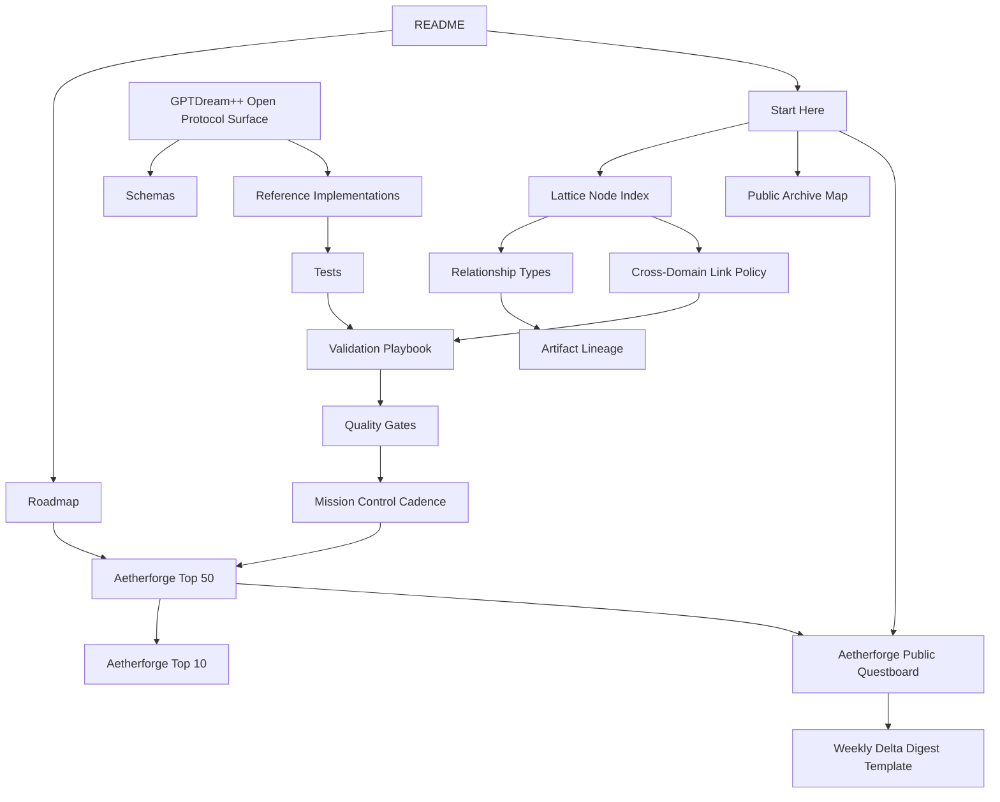

# Public Archive Map
Status: Candidate
Date: 2026-05-27

This map visualizes the lattice relationship between doctrine, projects, governance, validation, and protocol layers.

## Map interpretation

- **Centerline**: README -> START_HERE -> ROADMAP sets mission and orientation.
- **Execution ring**: Top-50/Top-10 taskboards plus questboard drive playable work.
- **Quality ring**: validation, quality gates, and weekly cadence enforce trust.
- **Protocol ring**: GPTDream++ specs, schemas, implementations, and tests form open protocol surface.

## Related

- [LATTICE_KNOWLEDGE_GRAPH_NODE_INDEX.md](./LATTICE_KNOWLEDGE_GRAPH_NODE_INDEX.md)
- [CROSS_DOMAIN_LINK_POLICY.md](./CROSS_DOMAIN_LINK_POLICY.md)
