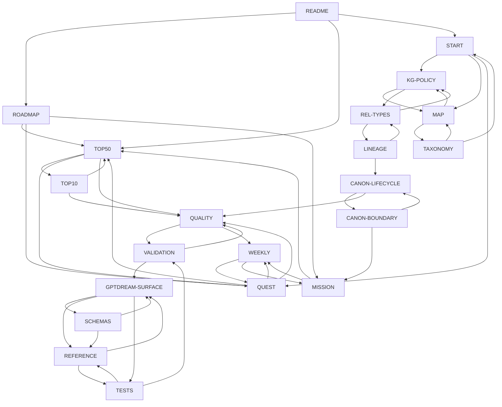

```mermaid
graph TD
    N_README[README]
    N_ROADMAP[ROADMAP]
    N_START[START]
    N_TOP50[TOP50]
    N_TOP10[TOP10]
    N_QUEST[QUEST]
    N_KG_POLICY[KG-POLICY]
    N_REL_TYPES[REL-TYPES]
    N_MAP[MAP]
    N_TAXONOMY[TAXONOMY]
    N_LINEAGE[LINEAGE]
    N_CANON_LIFECYCLE[CANON-LIFECYCLE]
    N_CANON_BOUNDARY[CANON-BOUNDARY]
    N_QUALITY[QUALITY]
    N_VALIDATION[VALIDATION]
    N_WEEKLY[WEEKLY]
    N_GPTDREAM_SURFACE[GPTDREAM-SURFACE]
    N_SCHEMAS[SCHEMAS]
    N_REFERENCE[REFERENCE]
    N_TESTS[TESTS]
    N_MISSION[MISSION]
    N_README --> N_ROADMAP
    N_README --> N_TOP50
    N_README --> N_START
    N_ROADMAP --> N_TOP50
    N_ROADMAP --> N_QUEST
    N_ROADMAP --> N_MISSION
    N_START --> N_KG_POLICY
    N_START --> N_MAP
    N_START --> N_QUEST
    N_TOP50 --> N_TOP10
    N_TOP50 --> N_QUEST
    N_TOP50 --> N_QUALITY
    N_TOP10 --> N_TOP50
    N_TOP10 --> N_QUALITY
    N_QUEST --> N_TOP50
    N_QUEST --> N_WEEKLY
    N_QUEST --> N_QUALITY
    N_KG_POLICY --> N_MAP
    N_KG_POLICY --> N_REL_TYPES
    N_REL_TYPES --> N_LINEAGE
    N_REL_TYPES --> N_KG_POLICY
    N_MAP --> N_TAXONOMY
    N_MAP --> N_KG_POLICY
    N_TAXONOMY --> N_MAP
    N_TAXONOMY --> N_START
    N_LINEAGE --> N_REL_TYPES
    N_LINEAGE --> N_CANON_LIFECYCLE
    N_CANON_LIFECYCLE --> N_CANON_BOUNDARY
    N_CANON_LIFECYCLE --> N_QUALITY
    N_CANON_BOUNDARY --> N_CANON_LIFECYCLE
    N_CANON_BOUNDARY --> N_MISSION
    N_QUALITY --> N_VALIDATION
    N_QUALITY --> N_WEEKLY
    N_VALIDATION --> N_QUALITY
    N_VALIDATION --> N_GPTDREAM_SURFACE
    N_WEEKLY --> N_QUEST
    N_WEEKLY --> N_MISSION
    N_GPTDREAM_SURFACE --> N_SCHEMAS
    N_GPTDREAM_SURFACE --> N_REFERENCE
    N_GPTDREAM_SURFACE --> N_TESTS
    N_SCHEMAS --> N_GPTDREAM_SURFACE
    N_SCHEMAS --> N_REFERENCE
    N_REFERENCE --> N_GPTDREAM_SURFACE
    N_REFERENCE --> N_TESTS
    N_TESTS --> N_REFERENCE
    N_TESTS --> N_VALIDATION
    N_MISSION --> N_WEEKLY
    N_MISSION --> N_TOP50
```
