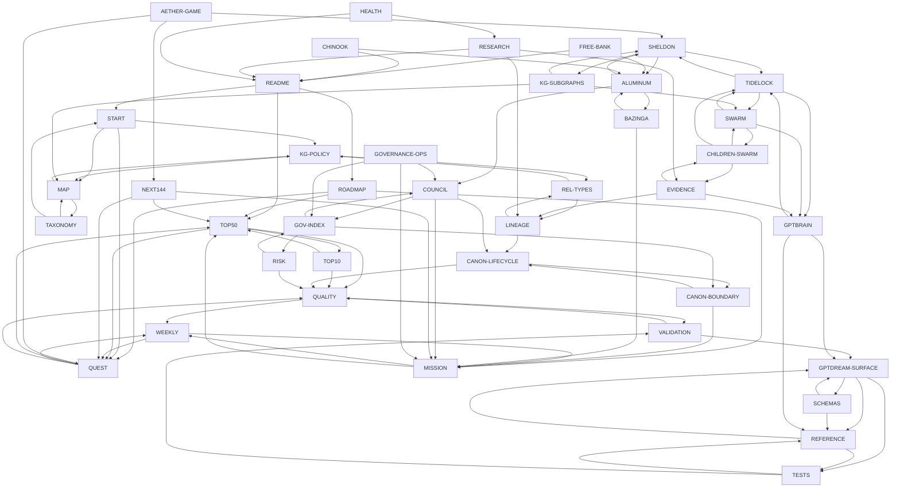

```mermaid
graph TD
    N_README[README]
    N_ROADMAP[ROADMAP]
    N_START[START]
    N_TOP50[TOP50]
    N_TOP10[TOP10]
    N_QUEST[QUEST]
    N_KG_POLICY[KG-POLICY]
    N_REL_TYPES[REL-TYPES]
    N_MAP[MAP]
    N_TAXONOMY[TAXONOMY]
    N_LINEAGE[LINEAGE]
    N_CANON_LIFECYCLE[CANON-LIFECYCLE]
    N_CANON_BOUNDARY[CANON-BOUNDARY]
    N_QUALITY[QUALITY]
    N_VALIDATION[VALIDATION]
    N_WEEKLY[WEEKLY]
    N_GPTDREAM_SURFACE[GPTDREAM-SURFACE]
    N_SCHEMAS[SCHEMAS]
    N_REFERENCE[REFERENCE]
    N_TESTS[TESTS]
    N_MISSION[MISSION]
    N_SHELDON[SHELDON]
    N_ALUMINUM[ALUMINUM]
    N_BAZINGA[BAZINGA]
    N_COUNCIL[COUNCIL]
    N_GOV_INDEX[GOV-INDEX]
    N_RISK[RISK]
    N_TIDELOCK[TIDELOCK]
    N_GPTBRAIN[GPTBRAIN]
    N_SWARM[SWARM]
    N_CHILDREN_SWARM[CHILDREN-SWARM]
    N_EVIDENCE[EVIDENCE]
    N_KG_SUBGRAPHS[KG-SUBGRAPHS]
    N_NEXT144[NEXT144]
    N_AETHER_GAME[AETHER-GAME]
    N_FREE_BANK[FREE-BANK]
    N_CHINOOK[CHINOOK]
    N_RESEARCH[RESEARCH]
    N_HEALTH[HEALTH]
    N_GOVERNANCE_OPS[GOVERNANCE-OPS]
    N_README --> N_ROADMAP
    N_README --> N_TOP50
    N_README --> N_START
    N_ROADMAP --> N_TOP50
    N_ROADMAP --> N_QUEST
    N_ROADMAP --> N_MISSION
    N_START --> N_KG_POLICY
    N_START --> N_MAP
    N_START --> N_QUEST
    N_TOP50 --> N_TOP10
    N_TOP50 --> N_QUEST
    N_TOP50 --> N_QUALITY
    N_TOP10 --> N_TOP50
    N_TOP10 --> N_QUALITY
    N_QUEST --> N_TOP50
    N_QUEST --> N_WEEKLY
    N_QUEST --> N_QUALITY
    N_KG_POLICY --> N_MAP
    N_KG_POLICY --> N_REL_TYPES
    N_REL_TYPES --> N_LINEAGE
    N_REL_TYPES --> N_KG_POLICY
    N_MAP --> N_TAXONOMY
    N_MAP --> N_KG_POLICY
    N_TAXONOMY --> N_MAP
    N_TAXONOMY --> N_START
    N_LINEAGE --> N_REL_TYPES
    N_LINEAGE --> N_CANON_LIFECYCLE
    N_CANON_LIFECYCLE --> N_CANON_BOUNDARY
    N_CANON_LIFECYCLE --> N_QUALITY
    N_CANON_BOUNDARY --> N_CANON_LIFECYCLE
    N_CANON_BOUNDARY --> N_MISSION
    N_QUALITY --> N_VALIDATION
    N_QUALITY --> N_WEEKLY
    N_VALIDATION --> N_QUALITY
    N_VALIDATION --> N_GPTDREAM_SURFACE
    N_WEEKLY --> N_QUEST
    N_WEEKLY --> N_MISSION
    N_GPTDREAM_SURFACE --> N_SCHEMAS
    N_GPTDREAM_SURFACE --> N_REFERENCE
    N_GPTDREAM_SURFACE --> N_TESTS
    N_SCHEMAS --> N_GPTDREAM_SURFACE
    N_SCHEMAS --> N_REFERENCE
    N_REFERENCE --> N_GPTDREAM_SURFACE
    N_REFERENCE --> N_TESTS
    N_TESTS --> N_REFERENCE
    N_TESTS --> N_VALIDATION
    N_MISSION --> N_WEEKLY
    N_MISSION --> N_TOP50
    N_SHELDON --> N_ALUMINUM
    N_SHELDON --> N_TIDELOCK
    N_SHELDON --> N_KG_SUBGRAPHS
    N_ALUMINUM --> N_SHELDON
    N_ALUMINUM --> N_COUNCIL
    N_ALUMINUM --> N_BAZINGA
    N_BAZINGA --> N_ALUMINUM
    N_BAZINGA --> N_MISSION
    N_COUNCIL --> N_GOV_INDEX
    N_COUNCIL --> N_CANON_LIFECYCLE
    N_COUNCIL --> N_MISSION
    N_GOV_INDEX --> N_COUNCIL
    N_GOV_INDEX --> N_CANON_BOUNDARY
    N_GOV_INDEX --> N_RISK
    N_RISK --> N_GOV_INDEX
    N_RISK --> N_QUALITY
    N_TIDELOCK --> N_GPTBRAIN
    N_TIDELOCK --> N_SHELDON
    N_TIDELOCK --> N_SWARM
    N_GPTBRAIN --> N_TIDELOCK
    N_GPTBRAIN --> N_GPTDREAM_SURFACE
    N_GPTBRAIN --> N_REFERENCE
    N_SWARM --> N_TIDELOCK
    N_SWARM --> N_GPTBRAIN
    N_SWARM --> N_CHILDREN_SWARM
    N_CHILDREN_SWARM --> N_SWARM
    N_CHILDREN_SWARM --> N_TIDELOCK
    N_CHILDREN_SWARM --> N_EVIDENCE
    N_EVIDENCE --> N_CHILDREN_SWARM
    N_EVIDENCE --> N_GPTBRAIN
    N_EVIDENCE --> N_LINEAGE
    N_KG_SUBGRAPHS --> N_SHELDON
    N_KG_SUBGRAPHS --> N_MAP
    N_KG_SUBGRAPHS --> N_SWARM
    N_NEXT144 --> N_TOP50
    N_NEXT144 --> N_QUEST
    N_NEXT144 --> N_MISSION
    N_AETHER_GAME --> N_NEXT144
    N_AETHER_GAME --> N_QUEST
    N_AETHER_GAME --> N_SHELDON
    N_FREE_BANK --> N_README
    N_FREE_BANK --> N_ALUMINUM
    N_CHINOOK --> N_README
    N_CHINOOK --> N_ALUMINUM
    N_RESEARCH --> N_README
    N_RESEARCH --> N_EVIDENCE
    N_RESEARCH --> N_LINEAGE
    N_HEALTH --> N_README
    N_HEALTH --> N_RESEARCH
    N_GOVERNANCE_OPS --> N_GOV_INDEX
    N_GOVERNANCE_OPS --> N_COUNCIL
    N_GOVERNANCE_OPS --> N_MISSION
```
