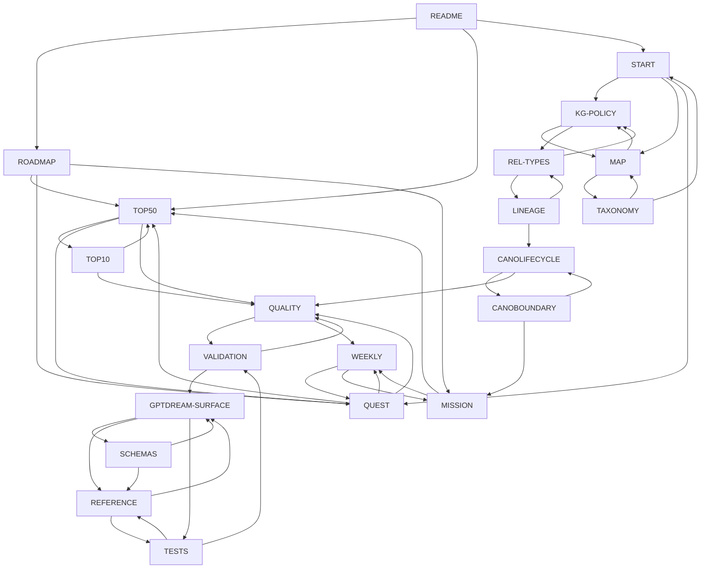

```mermaid
graph TD
    N-README[README]
    N-ROADMAP[ROADMAP]
    N-START[START]
    N-TOP50[TOP50]
    N-TOP10[TOP10]
    N-QUEST[QUEST]
    N-KG-POLICY[KG-POLICY]
    N-REL-TYPES[REL-TYPES]
    N-MAP[MAP]
    N-TAXONOMY[TAXONOMY]
    N-LINEAGE[LINEAGE]
    N-CANON-LIFECYCLE[CANOLIFECYCLE]
    N-CANON-BOUNDARY[CANOBOUNDARY]
    N-QUALITY[QUALITY]
    N-VALIDATION[VALIDATION]
    N-WEEKLY[WEEKLY]
    N-GPTDREAM-SURFACE[GPTDREAM-SURFACE]
    N-SCHEMAS[SCHEMAS]
    N-REFERENCE[REFERENCE]
    N-TESTS[TESTS]
    N-MISSION[MISSION]
    N-README --> N-ROADMAP
    N-README --> N-TOP50
    N-README --> N-START
    N-ROADMAP --> N-TOP50
    N-ROADMAP --> N-QUEST
    N-ROADMAP --> N-MISSION
    N-START --> N-KG-POLICY
    N-START --> N-MAP
    N-START --> N-QUEST
    N-TOP50 --> N-TOP10
    N-TOP50 --> N-QUEST
    N-TOP50 --> N-QUALITY
    N-TOP10 --> N-TOP50
    N-TOP10 --> N-QUALITY
    N-QUEST --> N-TOP50
    N-QUEST --> N-WEEKLY
    N-QUEST --> N-QUALITY
    N-KG-POLICY --> N-MAP
    N-KG-POLICY --> N-REL-TYPES
    N-REL-TYPES --> N-LINEAGE
    N-REL-TYPES --> N-KG-POLICY
    N-MAP --> N-TAXONOMY
    N-MAP --> N-KG-POLICY
    N-TAXONOMY --> N-MAP
    N-TAXONOMY --> N-START
    N-LINEAGE --> N-REL-TYPES
    N-LINEAGE --> N-CANON-LIFECYCLE
    N-CANON-LIFECYCLE --> N-CANON-BOUNDARY
    N-CANON-LIFECYCLE --> N-QUALITY
    N-CANON-BOUNDARY --> N-CANON-LIFECYCLE
    N-CANON-BOUNDARY --> N-MISSION
    N-QUALITY --> N-VALIDATION
    N-QUALITY --> N-WEEKLY
    N-VALIDATION --> N-QUALITY
    N-VALIDATION --> N-GPTDREAM-SURFACE
    N-WEEKLY --> N-QUEST
    N-WEEKLY --> N-MISSION
    N-GPTDREAM-SURFACE --> N-SCHEMAS
    N-GPTDREAM-SURFACE --> N-REFERENCE
    N-GPTDREAM-SURFACE --> N-TESTS
    N-SCHEMAS --> N-GPTDREAM-SURFACE
    N-SCHEMAS --> N-REFERENCE
    N-REFERENCE --> N-GPTDREAM-SURFACE
    N-REFERENCE --> N-TESTS
    N-TESTS --> N-REFERENCE
    N-TESTS --> N-VALIDATION
    N-MISSION --> N-WEEKLY
    N-MISSION --> N-TOP50
```
