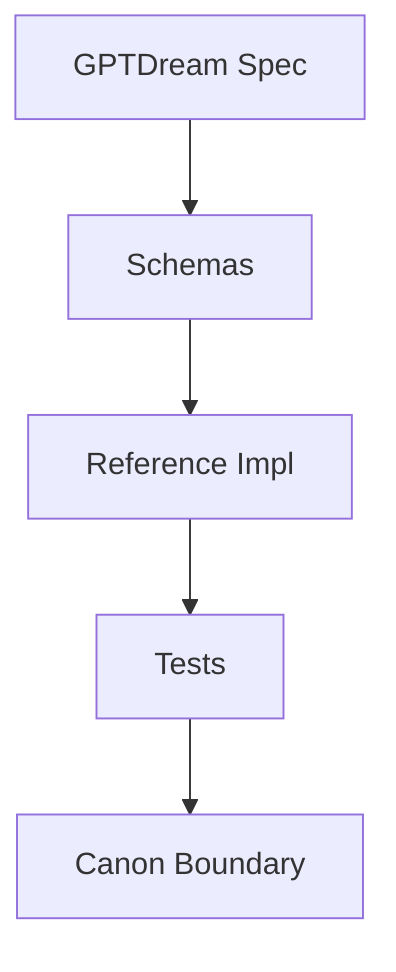

# Primer: GPTDream Protocols
Status: Candidate
Date: 2026-05-28

## Focus

Open protocol surface for reproducible dreaming and evidence artifacts.

## Cross-links

- [Primer: Lattice Foundations](./PRIMER_LATTICE_FOUNDATIONS.md)
- [Primer: Aetherforge Play](./PRIMER_AETHERFORGE_PLAY.md)
